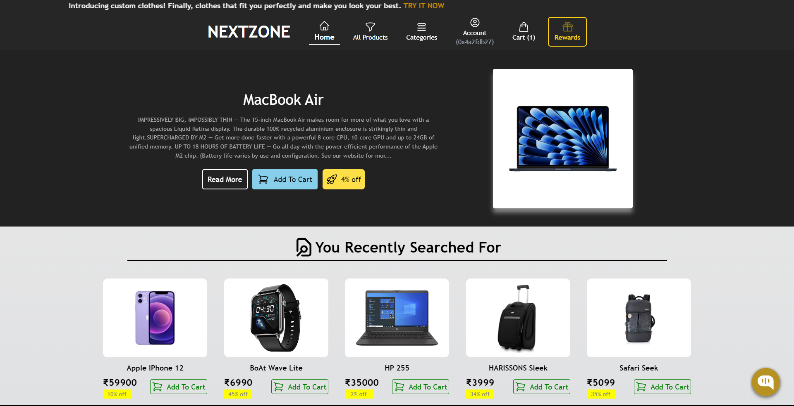
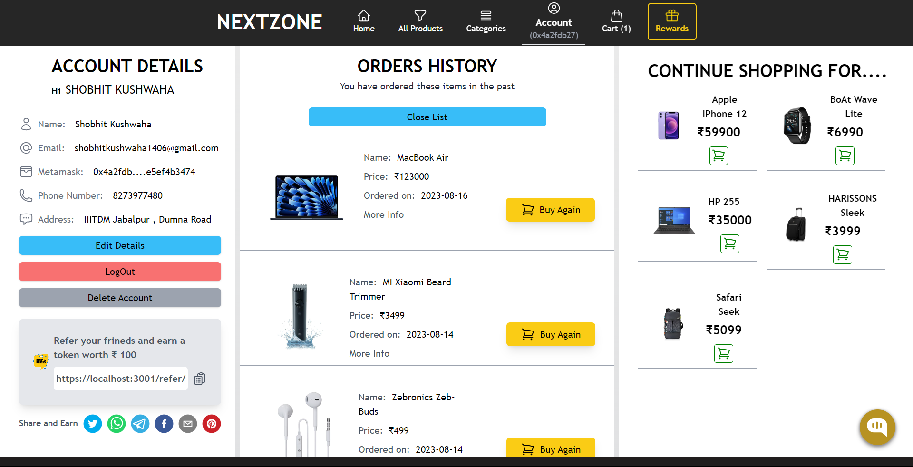
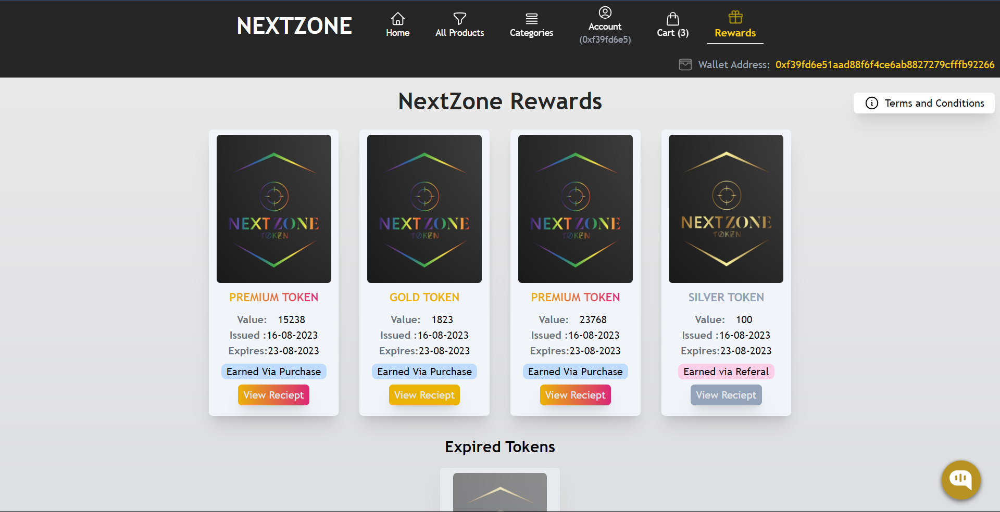
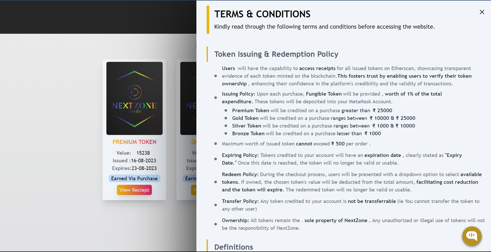
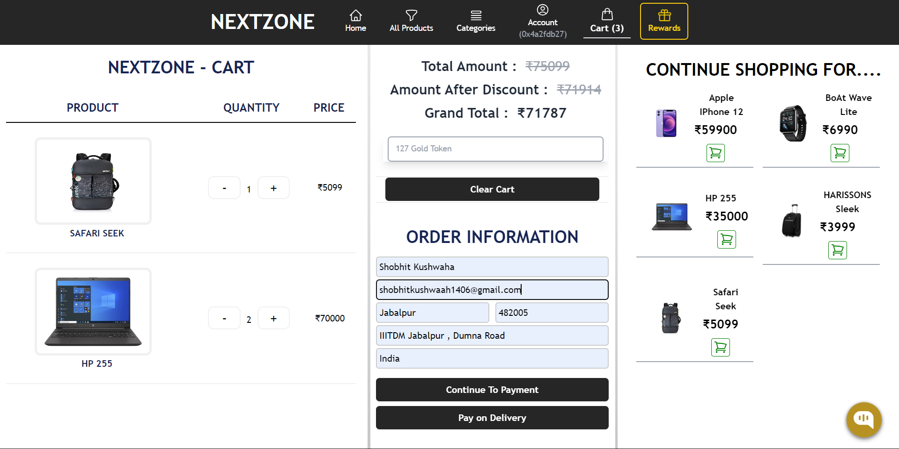
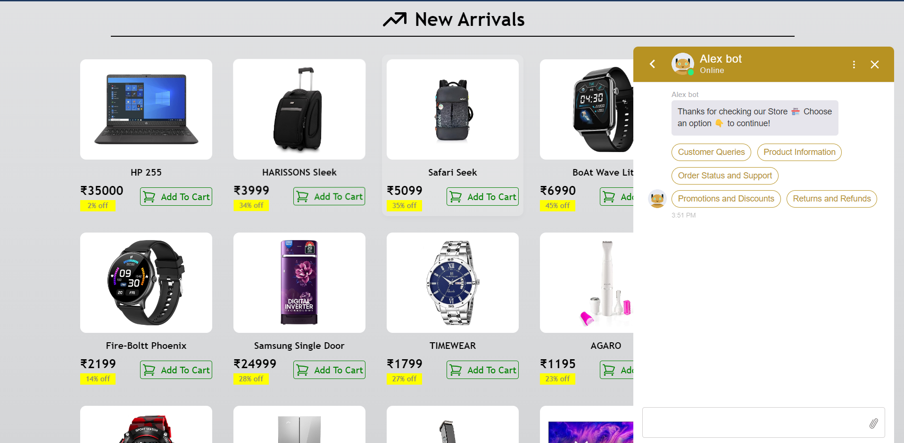
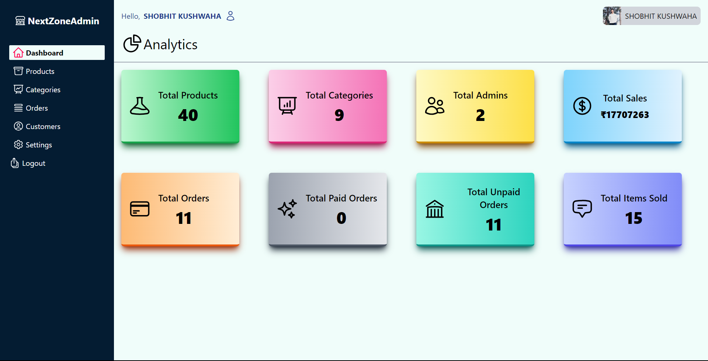
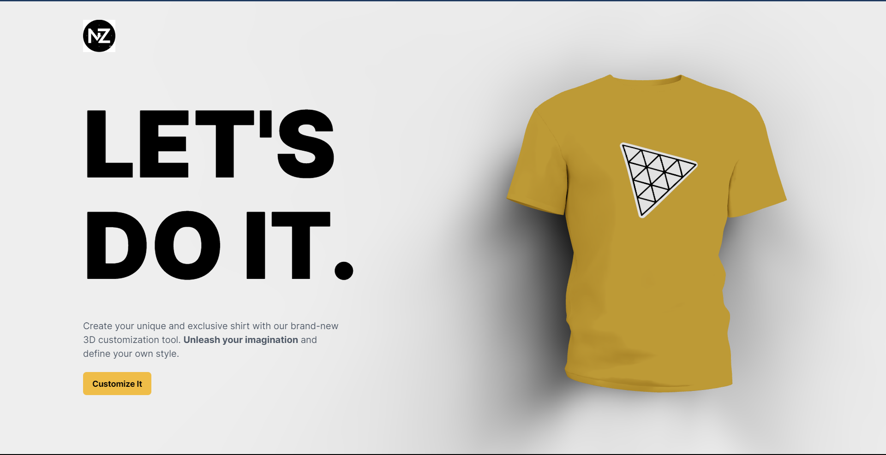
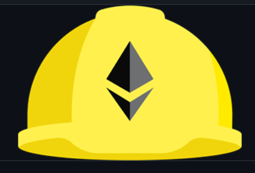
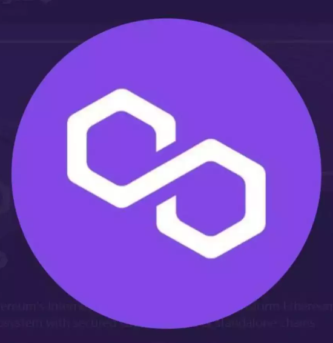

<div align = "center">


<h1 align="center"> <font size="5"> <b> NextZone </b></h1>
<!-- PROJECT LOGO -->

<h2><b>🔗 Ecommerce platform with Blockchain Based Loyalty & Rewards System</b></h2>

  
# [DEMO LINK](https://drive.google.com/file/d/11xk3s51DabcfCA30YOiBRKTqRxXxE8m9/view?usp=drive_link)

  </div>
  
---

<div align="center">

  </div>

---

<div align="center" style="display:flex ">

</div>
<table>
  <tr>
    <td></td>
    <td></td>
  </tr>
  <tr>
    <td></td>
    <td></td>
  </tr>
  <tr>
    <td></td>
    <td></td>
  </tr>
  <tr>
    <td></td>
    <td></td>
  </tr>
</table>

---
## About the Site 🚀

---

Blockchain based: Loyalty & Reward Program using Fungible Token


We've developed a cutting-edge Rewards and Loyalty system for our e-commerce platform NextZone, leveraging blockchain technology and fungible tokens. With distinct client and admin applications, users can earn tokens for purchases, referrals, and engagement. The transparent and secure blockchain ensures trust, while the user-friendly apps enhance the experience, creating a seamless and rewarding shopping ecosystem.

<br>

● **Token Rewards System**: Grants users tokens based on their purchase amount, nurturing loyalty through tangible incentives. Accumulated tokens can be redeemed for discounts, exclusive offers, fostering lasting engagement and brand allegiance.

● **Token Transparency**: Real-time view of token status on Etherscan. All the earned, available, expired, and redeemed tokens reciepts are available. Users will be able to see the credited tokens on their Metamask Wallet and the website.

● **Rewards Section**: Dedicated rewards section showing all the Tokens earned by user, expired tokens and the tokens redemmed by the user. With all the terms and conditions clearly stated.


● **User Authentication**: Secure process for registration and login using JWT, ensuring privacy and personalized shopping.

● **Smart Filtering**: Advanced filters for faster, relevant product searches matching user preferences.

● **Effortless Cart Management**: Intuitive cart system streamlines checkout preparation and item tracking.

● **Account Dashboard**: User-friendly interface for order tracking, data management,account information and earned token visibility.

● **Safe Payment Handling**: Reliable gateway ensures secure and smooth transactions, boosting user trust.

● **Tailored Recommendations**: Personalized product suggestions driven by purchase history and preferences.

● **Virtual Try-On**: 3D model integration for virtual clothing trials, aiding informed purchase decisions.

● **Instant Chat Assistance**: Responsive chatbot offers prompt support, enhancing the shopping experience and guiding user through the website.

<!-- ● **Deployment**: Used the Polygon blockchain to deploy our solution and demonstrate the final product. -->
<!-- ●   WE used the Polygon blockchain to deploy our solution and demo the final product as a web prototype🔗<br> -->
---

## How to Run Client Side of the Website⚡

---

````
1. git clone https://github.com/shokushwaha/Grid-HackWizards.git

2. cd client

3. npm install

4. Create a .env file and add the following environment variables:

MONGODB_URI=""
STRIPE_PK=""
STRIPE_SK=""
PUBLIC_URL=""
NODE_ENV=''
GOLD_URL=""
PREMIUM_URL=""
SILVER_URL=""
BRONZE_URL=""
OPENAI_API=""

5. npm run dev
````
## How to Run Admin Side of the Website⚡

---

````
1. git clone https://github.com/shokushwaha/Grid-HackWizards.git

2. cd admin

3. npm install

4. Create a .env file and add the following environment variables:

GOOGLE_CLIENT_ID=""
GOOGLE_CLIENT_SECRET=""
NEXT_AUTH_SECRET=""
MONGODB_URI=""
NODE_ENV=""

5. npm run dev
````


## Tech Stack 💻

---

### WEB 3.0 :

- Hardhat 
  </div>
- Mocha 
  </div>
- Solidity 
  </div>
- Polygon 
  </div>

### Frontend :

  

### Backend :
 


## Contributors ✨

Thanks goes to these wonderful people ❤️

<!-- ALL-CONTRIBUTORS-LIST:START - Do not remove or modify this section -->
<!-- prettier-ignore-start -->
<!-- markdownlint-disable -->
<table>
  <tr>
    <td align="center"><a href="https://github.com/shokushwaha"><br /><sub><b>Shobhit Kushwaha</b></sub></a><br /></td>
    <td align="center"><a href="https://github.com/RishabhSharma96"><br /><sub><b>Rishabh Sharma</b></sub></td>
    <td align="center"><a href="https://github.com/ayush09316"><br /><sub><b>Ayush Sharma</b></sub></td>
  </tr>
</table>

<!-- markdownlint-restore -->
<!-- prettier-ignore-end -->

<!-- ALL-CONTRIBUTORS-LIST:END -->
